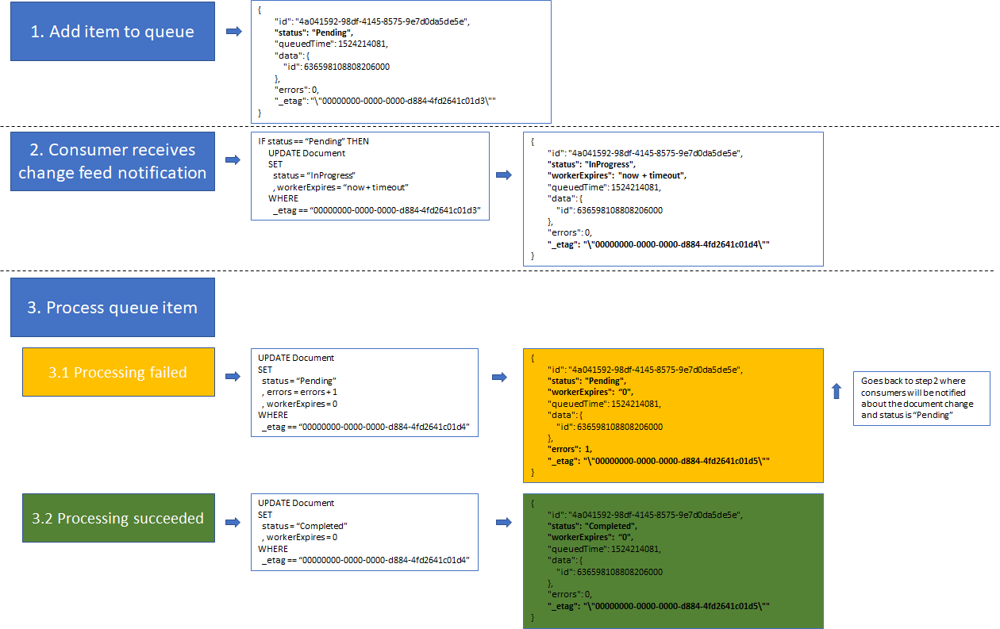

# CosmosDB based Queue
DISCLAIMER: This is a draft implementation with many open/sub-optimal implementation choices.

This repository contains a simple CosmosDB based queue implementation. The implementation relies on [change feed notifications](https://azure.microsoft.com/en-us/blog/introducing-the-azure-cosmosdb-change-feed-processor-library/) to discover pending elements to be processed. Adquiring a lock for a queue item relies on optimistic locking of the document (based on ETag) which thens guarantees that only one worker is processing the item (in case multiple consumers with different leases are running in parallel).

This repository contains 3 projects:
|Project|Description|
|-|-|
|CosmosDBQueue|Contains the queue (producer and consumer) implementation|
|sample/ConsumerSample|Contains a sample consumer application|
|sample/ProducerSample|Contains a sample producer application|

## Queue implementation in CosmosDB

The picture below demostrates how an item queued goes through the processing system



1. Producers enqueues item with payload `{ id: 636598108808206000 }`
1. Following document is added to 'queue' collection
```json
{
    "id": "4a041592-98df-4145-8575-9e7d0da5de5e",
    "status": "Pending",
    "queuedTime": 1524214081,
    "data": {
        "id": 636598108808206000
    },
    "errors": 0,
    "_etag": "\"00000000-0000-0000-d884-4fd2641c01d3\""
}
```
3. Consumer receives change documents feed. For each document in status 'Pending' it tries to adquire a lock by updating the status to "InProgress" if the ETag matches (optimistic locking)
1. For queue items where the lock was adquired: call the registered callback. Depending on the callback call response update the document accordingly:

    1. **Callback call fails** &rarr; sets status to **"Pending"** and increment errors [item will go back to step 3]
    1. **Callback succeededs** &rarr; sets status to **"Completed"**

## Producing queue items

The following code snippet shows how you can produce items for the queue
```c#
using (var producer = new CosmosDBQueueProducer())
{
    var settings = new CosmosDBQueueProducerSettings
    {
        QueueCollectionDefinition = new CosmosDBCollectionDefinition
        {
            Endpoint = "https://localhost:8081",
            SecretKey = "C2y6yDjf5/R+ob0N8A7Cgv30VRDJIWEHLM+4QDU5DE2nQ9nDuVTqobD4b8mGGyPMbIZnqyMsEcaGQy67XIw/Jw==",
            CollectionName = "queue",
            Throughput = 1000,
            DbName = "queue",
        },

    };
    await producer.Initialize(settings);

    await producer.Queue(new { customerId = "3123123", name = "John" });
}
```

## Consuming queue items
The following code snippet shows how you can consume items from queue
```c#
var consumer = new CosmosDBQueueConsumer();

consumer.OnMessage = async (string message) =>
{
    // Handle the message here
    await Task.Delay(50);
    return true;
};

var settings = new CosmosDBQueueConsumerSettings()
{
    LeaseCollectionDefinition = new CosmosDBCollectionDefinition
    {
        Endpoint = "https://localhost:8081",
        SecretKey = "C2y6yDjf5/R+ob0N8A7Cgv30VRDJIWEHLM+4QDU5DE2nQ9nDuVTqobD4b8mGGyPMbIZnqyMsEcaGQy67XIw/Jw==",
        CollectionName = "lease",
        Throughput = 400,
        DbName = "queue",
    },

    QueueCollectionDefinition = new CosmosDBCollectionDefinition
    {
        Endpoint = "https://localhost:8081",
        SecretKey = "C2y6yDjf5/R+ob0N8A7Cgv30VRDJIWEHLM+4QDU5DE2nQ9nDuVTqobD4b8mGGyPMbIZnqyMsEcaGQy67XIw/Jw==",
        CollectionName = "queue",
        Throughput = 1000,
        DbName = "queue",
    },

    using (var cts = new CancellationTokenSource())
    {
        await consumer.Start(settings, cts);

        Console.WriteLine("Started, press a key to stop");
        Console.ReadLine();

        cts.Cancel();
    }
};
```

## Known issues

The current implementation has some details that can be optimized.

- Acquiring a lock to a queue item requires a change in the item, thus generating another "change feed notification" that is filtered out by consumers (status != 'Pending'). A possible aproach would be to use a lease/lock collection to adquire such locks (first to create the document with queue item id is the winner). What needs to be discussed are the costs inherited by the choice (costs of having 2 collections vs 1 collection generating change feed events that we don't care)

- If a consumer dies in the middle of processing an item the queued item will remaing in status 'InProgress' forever. A scheduled task needs to collect all items in status "InProgress" where the "workerExpires" is greater than now (+ grace period), setting the item status to "Pending". Ideally a stored procedure that runs every x seconds.

- Changes to documents are done in a loop, ideally they should be done using a stored procedure processing a collection of documents in batch

- This library is a proof of concept quality and thus needs improvement in many aspects, such as:
    - error handling
    - tracing
    - monitoring
    - retry policies when calling external dependencies
